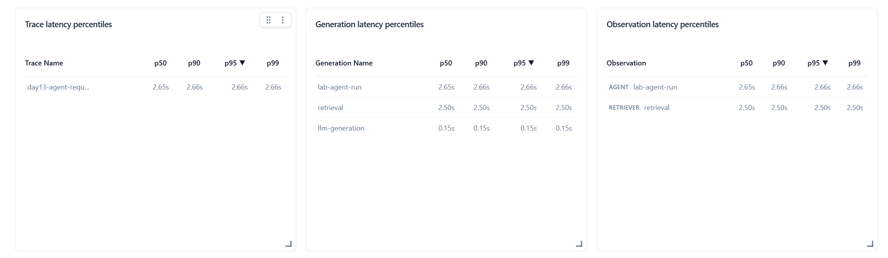
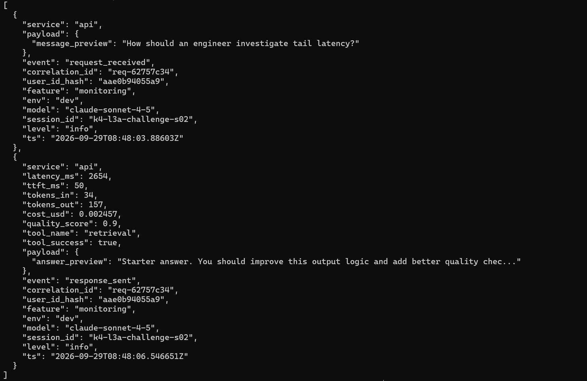
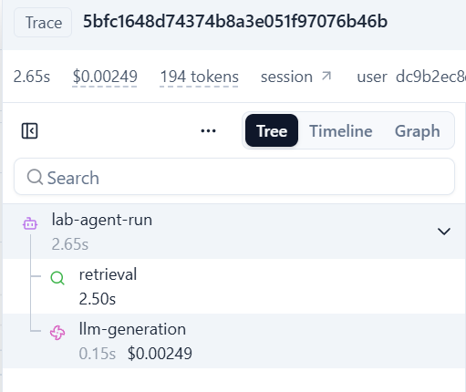

# Báo cáo cá nhân — K4-L3A Day 13 Monitoring & LLMOps

> Mỗi học viên hoàn thiện một file duy nhất này. Khi dẫn evidence, dùng đường dẫn tương đối, ví dụ `evidence/07-trace-waterfall.png`.

## 1. Thông tin học viên

- **Họ và tên:** Trịnh Đức Huy
- **MSSV:** 2A202602865
- **Lớp:** K4-L3A
- **Repository URL:** https://github.com/huytd2109/K4-L3-DAY13-TrinhDucHuy-2A202602865-Monitoring-LLMOps
- **Commit SHA cuối:**
- **Challenge ID:** `day13-k4-l3a-monitoring-llmops-v1`
- **Tên project Langfuse cá nhân:** `day13-k4-l3a-2A202602865`

## 2. Evidence index

Điền đúng đường dẫn tới evidence thực tế. Có thể đổi tên hoặc dùng nhiều ảnh nếu cần.

| Evidence | Đường dẫn |
|---|---|
| Pytest cuối | `evidence/01-pytest.png` |
| Log validator | `evidence/02-log-validator.png` |
| Dashboard validator | `evidence/03-dashboard-validator.png` |
| Structured log | `evidence/04-structured-log.png` |
| PII redaction | `evidence/05-pii-redaction.png` |
| Trace list | `evidence/06-trace-list.png` |
| Trace waterfall | `evidence/07-trace-waterfall.png` |
| Trace metadata | `evidence/08-trace-metadata.png` |
| Prompt versions | `evidence/09-prompt-versions.png` |
| Prompt rollback | `evidence/10-prompt-rollback.png` |
| Dashboard runtime | `evidence/11-dashboard-overview.png` |
| Incident metric | `evidence/12-incident-metric.png` |
| Incident log | `evidence/13-incident-log.png` |
| Incident trace | `evidence/14-incident-trace.png` |

## 3. Kết quả kỹ thuật

| Nội dung | Baseline | Kết quả cuối | Nhận xét |
|---|---|---|---|
| `validate_logs.py` | 50/100 do còn 20 log cũ | 100/100 | 61 records, 30 correlation IDs |
| `validate_dashboard.py` | 6/6 | 6/6 | Contract có đúng sáu panel |
| `pytest` | 22 passed | 22 passed | Dùng nguyên bộ test gốc |
| Số traces hợp lệ | Chưa có child observations | Tối thiểu 13 trace mới | 10 workload và 3 trace prompt versioning |
| Số PII leak | 0 | 0 | Validator không phát hiện PII thô |
| Latency P95 / TTFT P95 | Chưa ghi | 1322 ms / 50 ms | Snapshot từ `/metrics` sau workload CP2 |
| Retrieval success rate | Chưa ghi | 100% | Các retrieval event trong workload đều thành công |

## 4. Logging và PII

- **Cách tạo/nhận và truyền correlation ID:**
- **Các metadata được ghi vào structured log:**
- **Cách bảo đảm PII được scrub trước khi ghi:**
- **Cách kiểm chứng kết quả:**

## 5. Tracing và prompt versioning

- **Cách xác nhận traces do chính tôi tạo trong project cá nhân:** Chạy workload bằng repository cá nhân với project `day13-k4-l3a-2A202602865`, sau đó đối chiếu observations qua Langfuse API v2.
- **Cấu trúc root/retrieval/generation observations:** `lab-agent-run` (AGENT) là root; `retrieval` (RETRIEVER) và `llm-generation` (GENERATION) là hai child trực tiếp. Generation ghi model, usage input/output/total, total cost và managed prompt.
- **Cách nối trace với log:** Metadata của root chứa cùng `correlation_id` được trả trong response và ghi vào structured log.
- **Prompt name:** `day13-chat`
- **Version/label baseline:** Version 1, labels `baseline` và `production` sau rollback.
- **Version/label candidate:** Version 2, label `candidate`.
- **Trace ID của mỗi version:** baseline v1 `d612988fced1f8f628e32c05aae52523`; candidate v2 `bb5a5de732a2333eb79091d0fc45c5a5`; production khi promote v2 `9d762f083f37d11b79056e3fe094e0d3`.
- **Cách promote và rollback `production`:** Gán `production` cho v2, chạy một request để tạo trace xác nhận version 2, sau đó gán lại `production` cho v1. Kiểm tra cuối: `baseline=v1`, `candidate=v2`, `production=v1`.

## 6. Dashboard, SLO và alerts

- **Dashboard và sáu panel:** Contract 60 phút, refresh 30 giây, đủ latency/TTFT, traffic, errors/retrieval, cost, tokens và quality; `validate_dashboard.py` đạt 6/6.
- **SLO và lý do chọn:** 99.5% request phải có `response_sent` với latency không quá 3000 ms trong cửa sổ 28 ngày; ngưỡng khớp threshold P95 của dashboard.
- **Cách tính error budget:** `28 × 24 × 60 × 0.5% = 201.6` phút, tương đương 3 giờ 21 phút 36 giây request không đạt SLI trong mỗi cửa sổ.
- **Ba alert và runbook tương ứng:** P95 latency >3000 ms trong 5 phút; error rate >2% trong 5 phút; retrieval success <90% trong 10 phút. Tất cả gửi Slack, có severity, owner và hướng dẫn kiểm tra/mitigation tại `docs/alerts.md`.

## 7. Điều tra challenge

- **Challenge ID:** `day13-k4-l3a-monitoring-llmops-v1`
- **Khoảng thời gian điều tra:** 2026-09-29 08:47:49–08:48:17 UTC.
- **Triệu chứng từ metrics:** Latency P95 tăng lên 2655 ms, vượt ngưỡng challenge 2000 ms; cả 5/5 request challenge có latency 2652–2655 ms. 
- **Log line và correlation ID liên quan:** Event `response_sent` lúc `2026-09-29T08:48:06.546651Z`, `correlation_id=req-62757c34`, feature `monitoring`, latency 2654 ms, retrieval vẫn trả `tool_success=true`. 
- **Trace ID và span gây ảnh hưởng:** Trace `43a4ada700aa40219c5df0464ec3a619` có cùng correlation ID; root `lab-agent-run` mất 2.657 s, trong đó `retrieval` mất 2.502 s và `llm-generation` chỉ mất 0.152 s. 
- **Root cause:** Incident `rag_slow` làm bước retrieval chiếm khoảng 94% tổng thời gian trace; generation và TTFT không phải điểm nghẽn.
- **Fix action:** Tắt incident injection, khôi phục retrieval path bình thường; trong môi trường thật sẽ chuyển sang corpus/fallback đã kiểm chứng nếu dependency retrieval vượt timeout.
- **Preventive measure:** Theo dõi P95 end-to-end cùng duration của retrieval span, cảnh báo khi latency người dùng vượt ngưỡng duy trì, đặt timeout/circuit breaker và kiểm thử fallback định kỳ.

## 8. Giải thích và tự đánh giá

- **Một quyết định kỹ thuật quan trọng và lý do:**
- **Một lỗi/blocker đã gặp:**
- **Cách tìm nguyên nhân và xử lý:**
- **Cách hiểu luồng Metrics → Logs → Traces:**
- **Vai trò của prompt version, token/cost, SLO hoặc rollback trong vận hành LLM:**
- **Điều quan trọng nhất đã học:**
- **Hạn chế hoặc phần chưa hoàn thành, nếu có:**

## 9. Checklist trước khi nộp

- [ ] Kết quả và evidence thuộc commit SHA cuối.
- [ ] Tất cả ảnh/output mở được bằng đường dẫn tương đối.
- [x] Incident evidence nối đúng metric → log → trace.
- [ ] Trace/prompt evidence thuộc project Langfuse cá nhân và ảnh không lộ key/secret.
- [ ] Repository chạy lại được theo README.
- [ ] Không có secret, API key, PII thô hoặc evidence của người khác/lớp khác.
- [ ] URL repo và commit SHA cuối đã được nộp trên LMS/Codelabs.
